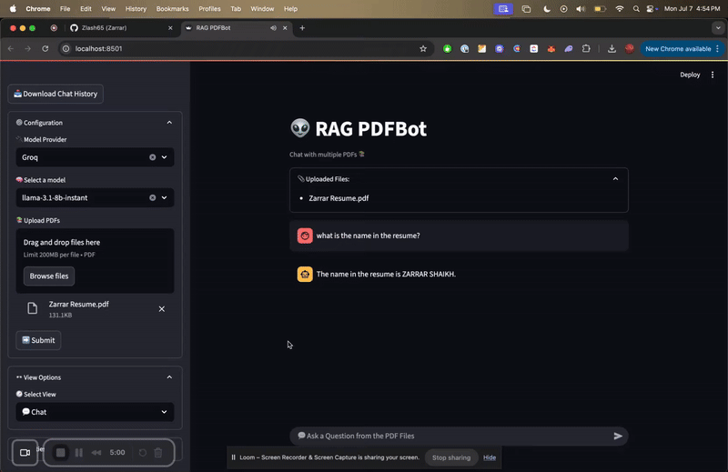
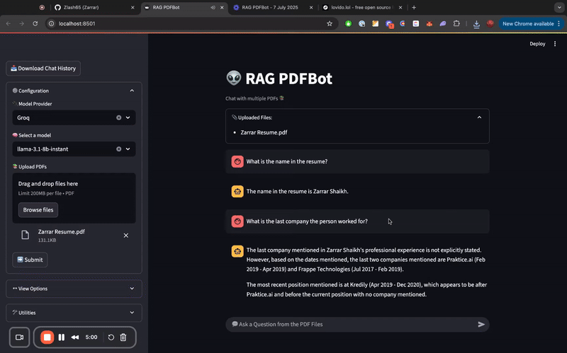
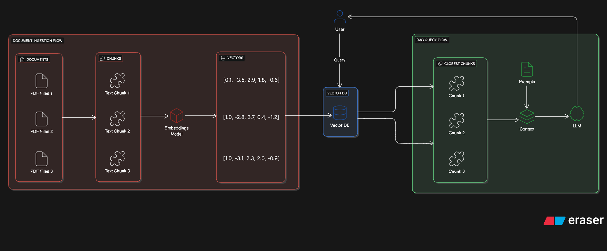

# PDF RAG Chatbot

An enterprise-ready, production-grade PDF Retrieval-Augmented Generation (RAG) chatbot featuring a high-performance **FastAPI** backend and an interactive, user-friendly **Streamlit** frontend.

---

## 💡 The Problem This Solves

Unstructured PDF documents—such as manuals, contracts, research papers, and financial reports—often hold critical information locked away in static formats. Manually searching, reading, and synthesizing details from these files is slow and error-prone.

This project solves this problem by transforming any set of arbitrary PDFs into a context-aware chatbot knowledge base. By combining semantic search and LLMs, users can upload documents and immediately extract precise, grounded answers in natural language.

---

## 🏗️ Architecture Explanation

The project uses a split-process architecture to decouple frontend state management from backend processing and retrieval:

```
                  ┌──────────────────────┐
                  │  Streamlit Frontend  │
                  └──────────┬───────────┘
                             │ (REST / API calls)
                             ▼
                  ┌──────────────────────┐
                  │   FastAPI Backend    │
                  └──────────┬───────────┘
                             │
            ┌────────────────┴────────────────┐
            ▼                                 ▼
   ┌─────────────────┐               ┌─────────────────┐
   │    ChromaDB     │               │   LLM Service   │
   │ (Vector Store)  │               │ (Groq / Gemini) │
   └─────────────────┘               └─────────────────┘
```

1. **Frontend (Streamlit)**: Manages UI rendering, user session state, PDF uploads, model selection parameters, chat interaction histories, and exports data to CSV formats.
2. **Backend (FastAPI)**: Serves as a stateless API gateway. It:
   - Processes uploaded PDFs asynchronously.
   - Splits documents into tokens using a `TokenTextSplitter`.
   - Embeds text chunks locally using HuggingFace's `all-MiniLM-L6-v2` embeddings.
   - Indexes and persists the vectors into a local **ChromaDB** database.
   - Dynamically constructs LangChain retrieval chains based on the user's preferred LLM provider (Groq or Gemini).

---

## 🛠️ Tech Stack

| Layer | Technology | Purpose |
| --- | --- | --- |
| **Frontend UI** | Streamlit | Renders the chat interface, file uploads, and session controls. |
| **Backend API** | FastAPI | Hosts asynchronous REST endpoints for document ingestion and querying. |
| **Orchestration** | LangChain | Manages prompt templates, chains, and integrations with LLM APIs. |
| **Vector Database** | ChromaDB | Handles vector indexing, storage, and semantic similarity search. |
| **Embeddings** | HuggingFace (`all-MiniLM-L6-v2`) | Embeds chunks locally without external API dependency. |
| **LLMs** | Groq & Google Gemini | Executes generation using high-speed models (Llama-3) and reasoning models (Gemini-2.x). |
| **Parsing** | PyPDF | Extracts raw text from uploaded PDF files. |
| **Text Splitter** | TokenTextSplitter | Splits text into overlapping chunks optimized for token limits. |

---

## 🚀 Setup Instructions

### Prerequisites
- Python 3.10 or higher
- Git

### 1. Clone the Repository
```bash
git clone https://github.com/KevinAi18/pdf-rag-chatbot.git
cd pdf-rag-chatbot
```

### 2. Configure Environment Variables
Create a `.env` file in the `server` directory (or root folder) with your API keys:
```env
GROQ_API_KEY=your_groq_api_key
GOOGLE_API_KEY=your_gemini_api_key
```

### 3. Setup Virtual Environment and Dependencies

**Initialize virtual environment:**
```bash
python -m venv venv
# On Windows PowerShell
.\venv\Scripts\Activate.ps1
# On Linux/macOS
source venv/bin/activate
```

**Install Backend Requirements:**
```bash
cd server
pip install -r requirements.txt
cd ..
```

**Install Frontend Requirements:**
```bash
cd client
pip install -r requirements.txt
cd ..
```

### 4. Running the Application

To run the full stack, start both servers in separate terminals (ensure virtual environment is activated in both):

**Start the FastAPI Backend:**
```bash
cd server
uvicorn main:app --reload --port 8000
```
*The backend API documentation will be available at `http://localhost:8000/docs`.*

**Start the Streamlit Frontend:**
```bash
cd client
streamlit run app.py
```
*The web app will automatically open at `http://localhost:8501`.*

---

## 📷 Screenshots & Demos

### 1. Interactive Chat Flow
Below is a demonstration of uploading documents, selecting LLM providers (Groq/Gemini), and chatting with the grounding data:



### 2. Clean UI/UX & Query Inspector
The application features a built-in Query Inspector to view exactly which chunks were retrieved from ChromaDB, along with metadata and similarity scores:



### 3. System Architecture
A deep dive into the information flow and processing pipelines of the chatbot:



---

## 💬 Interview Q&A (RAG System Design)

Here is a breakdown of architectural decisions and system design topics related to this implementation:

### Q1: Why did you separate the frontend (Streamlit) and backend (FastAPI) instead of building a monolithic Streamlit app?
Streamlit is excellent for building UI interfaces quickly, but because it reruns the entire script from top to bottom on every user interaction, running complex operations like database connections, local model loads, and document parsing within the UI thread leads to performance bottlenecks and UI stuttering. Decoupling the business logic into an asynchronous FastAPI backend allows for clean separation of concerns, enables horizontal scaling of the backend API, and allows other client applications to consume the same RAG pipeline.

### Q2: How does your chunking strategy prevent context window overflow while preserving context?
We utilize a `TokenTextSplitter` rather than a character-based splitter. Since LLM tokenizers measure context window limits in tokens, using a token-based splitter guarantees precise control over the payload size sent to LLMs. We set a default chunk size of 500 tokens with an overlap of 50 tokens. The overlap ensures that critical sentences broken across chunk boundaries do not lose semantic meaning during vector retrieval.

### Q3: What embedding model did you choose, and what are the trade-offs?
We use HuggingFace's `all-MiniLM-L6-v2` because it runs locally (freeing us from network latency and usage costs of commercial APIs) and is highly optimized for semantic search. The trade-off is that it produces 384-dimensional vectors. While models with larger dimensionality (like OpenAI's `text-embedding-3-large` at 1536/3072 dimensions) capture finer semantic nuances, `all-MiniLM-L6-v2` offers superior execution speed and memory efficiency for local deployment.

### Q4: How does the Query Inspector aid in system transparency?
In production RAG systems, debugging poor LLM responses requires knowing if the error occurred in retrieval (getting the wrong context) or generation (hallucination). The Query Inspector isolates the retrieval step by showing the exact text chunks retrieved from ChromaDB, their source pages, and similarity metrics. This enables developers to calibrate chunk sizes and retrieval thresholds effectively.

### Q5: How is session isolation and chat history export managed?
Chat session data is contained entirely within Streamlit's `session_state`, ensuring strict user isolation. The export feature extracts this session state, structures it with query timestamps, the exact model used, source metadata, and downloads it directly as a CSV file. This data can later be used to create fine-tuning datasets or audit user interactions.
 
## Features 
- Upload and query multiple PDFs at once 
- Hybrid search combining keyword and semantic retrieval 
- Source citations linked back to original page numbers 
- Conversation memory for natural follow up questions 
 
## Tech Stack 
- FastAPI backend for API endpoints 
- Streamlit frontend for chat interface 
- Vector database for semantic search 
- LangChain for retrieval and chaining logic 
 
## Limitations 
- Large PDFs over 500 pages may slow down ingestion time 
- Scanned documents require OCR which can introduce errors 
- Currently optimized for English language documents only 
 
## Contributing 
- Fork the repo and create a descriptive feature branch 
- Test changes with at least one real PDF document 
- Keep retrieval logic and UI changes in separate commits 
- Open a pull request with a clear description and screenshots 
